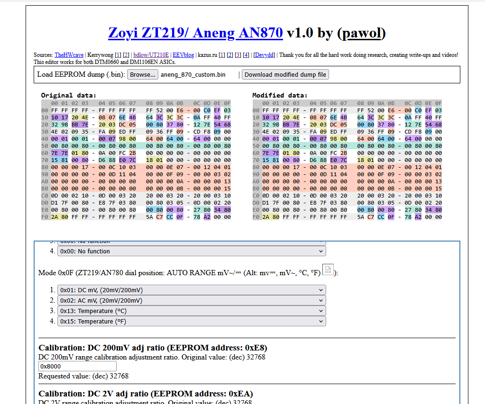
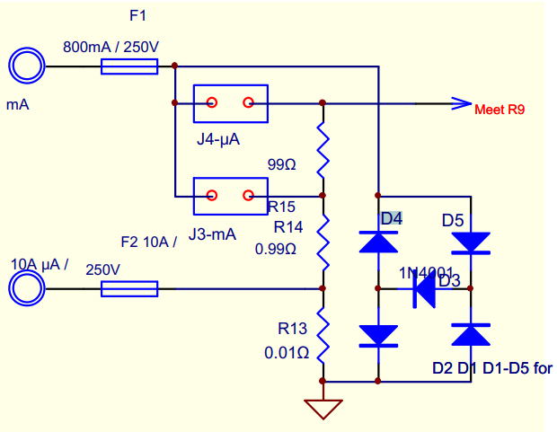
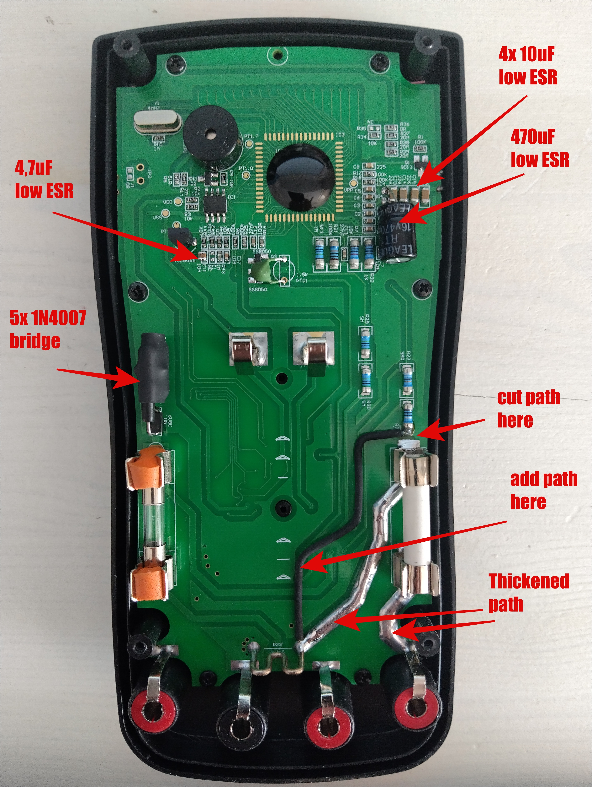

# Zoyi ZT219 / Aneng AN870 EEPROM Editor and HW improvements

Zoyi ZT219 / Aneng AN870 EEPROM Editor written in client-side in a single HTML page, fully offline.
A few HW improvements pointed.

You can download [offline eeprom editor](src/index.html)
and then just open index.html in a browser on your PC.
You can also use one [online eeprom editor](https://pawol.github.io/Zoyi-ZT219-Aneng-AN870-EEPROM-editor/src/index.html)

An example of dumped eeprom
[eeprom dump file](doc/aneng_870_original_eeprom_dump.bin)

# Inner workings

This project was created to alleviate the pain of hand-editing the hex dump and to explore contemporary JavaScript syntax along with API supported by the modern Chrome browser (other browsers not tested - pull requests fixing possible issues are welcomed!).

Should you notice any errors, want to add missing range, update the description, etc. feel free to open an issue or submit a pull request.

It should be rather easy task to modify the source code to support any other `EEPROM` - the page is generated dynamically based on [the `bin_ranges` variable]

# Hardware improvements

I suggest to introduce some hardware modifications.
The most important is to replace existing transil 6,8V onto 5 diodes bridge to ensure better protection of 1 ohm/0.2W shunt in case of accidential connection of ammeter (200mA range)
directly into 230 VAC socket. Transil is cheap and... nothing more. 6,8V makes that shunt resitor 1 ohm/0.2W has to bear 10x more power than in case of bridge.
The 5 diodes bridge (popular in the majority of multimeters) does not impact a measurement precision on uA and mA range.  Capacitors improve readout stability.

# Datasheets of DMM chip DTM0660L (the clone of HY12P65)
[Aneng AN870/Zoyi ZT219 schematic diagram](doc/Zoyi_zt219_Aneng_an870_v3.1_schematic.pdf)

[datasheet 1](doc/DTM0660_datasheet.pdf)

[datasheet 2](doc/DTM0660_datasheet_auto-translated.pdf)

[datasheet 3](doc/DS-HY12P65_EN.pdf)

[How to calibrate](doc/calibration.txt)

